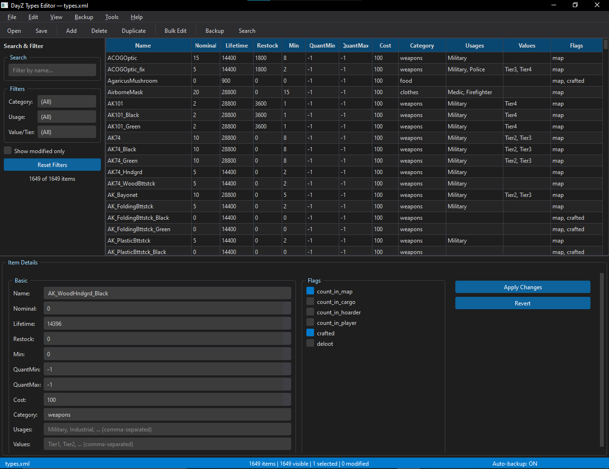
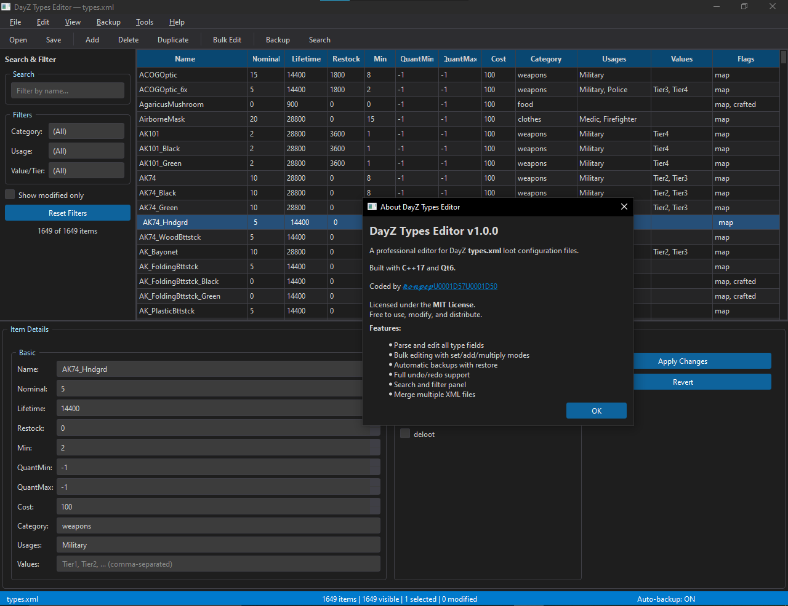

# DayZ Types Editor

A professional, feature-rich editor for DayZ `types.xml` loot configuration files.

Built with **C++17** and **Qt6**, featuring a dark VS Code-inspired theme.

---

## Screenshots





---

## Features

- Parse and display all fields from `types.xml`
- Inline cell editing directly in the table view
- Detail panel with labeled fields and flag checkboxes
- **Search & Filter** panel — filter by name, category, usage, value/tier, modified status
- **Bulk Edit** — modify nominal/lifetime/restock/min/quantmin/quantmax/cost across multiple items at once with **Set / Add / Multiply** modes
- **Undo / Redo** — full history for every edit, add, delete, and bulk-edit operation
- **Backup Manager** — automatic backups on save, manual backup, restore from a backup list, max 20 backups per file
- **Merge** — merge another `types.xml` into the current file (adds new items, updates existing ones by name)
- **Recent files** list (last 5)
- Dark VS Code-inspired theme (QSS + Fusion palette)
- Command-line file argument: `DayZTypesEditor.exe path/to/types.xml`

---

## Keyboard Shortcuts

| Shortcut | Action |
|----------|--------|
| Ctrl+O | Open file |
| Ctrl+S | Save |
| Ctrl+Z | Undo |
| Ctrl+Y | Redo |
| Ctrl+A | Select all |
| Ctrl+D | Duplicate selected |
| Ctrl+B | Bulk edit selected |
| Ctrl+N | Add new item |
| Ctrl+F | Focus search box |
| Delete | Delete selected |
| F5 | Reload file from disk |

---

## Build Requirements

| Tool | Minimum Version |
|------|----------------|
| Qt   | 6.2            |
| CMake | 3.16          |
| MSVC | 2019 / 2022    |
| MinGW | 11.x (GCC 11) |

---

## Build Instructions (Windows)

### 1. Install Qt6

Download the Qt Online Installer from [https://www.qt.io/download](https://www.qt.io/download).
Install at least these components:

- `Qt 6.x.x > MSVC 2022 64-bit` (or `MinGW 64-bit`)
- `Qt 6.x.x > Qt Xml` (included by default)
- `CMake` (bundled with the Qt installer, or install separately)

Alternatively, install Qt non-interactively with [aqtinstall](https://pypi.org/project/aqtinstall/):

```cmd
pip install aqtinstall
aqt install-qt windows desktop 6.8.3 win64_msvc2022_64 -O C:\Qt
```

### 2. Place the project folder

Simply place the `dayz-types-editor` folder anywhere on disk. No special setup needed.

### 3a. Build with MSVC (recommended)

Open **x64 Native Tools Command Prompt for VS 2022**, then:

```cmd
cd "C:\path\to\dayz-types-editor"
cmake -B build -G Ninja -DCMAKE_BUILD_TYPE=Release ^
      -DCMAKE_PREFIX_PATH="C:\Qt\6.8.3\msvc2022_64"
cmake --build build
```

The executable will be at `build\DayZTypesEditor.exe`.

### 3b. Build with MinGW

Open the **Qt MinGW 64-bit** terminal (from the Start menu shortcut installed by Qt):

```cmd
cd "C:\path\to\dayz-types-editor"
cmake -B build -G "MinGW Makefiles" ^
      -DCMAKE_PREFIX_PATH="C:\Qt\6.x.x\mingw_64" ^
      -DCMAKE_BUILD_TYPE=Release
cmake --build build
```

The executable will be at `build\DayZTypesEditor.exe`.

### 3c. Build with Qt Creator (easiest)

1. Open **Qt Creator**
2. File → Open File or Project → select `CMakeLists.txt`
3. Configure with your Qt6 kit
4. Press **Build** (Ctrl+B), then **Run** (Ctrl+R)

### 4. Deploy (optional — standalone distribution)

After building, run `windeployqt` to copy the required Qt DLLs next to the executable:

```cmd
cd build
"C:\Qt\6.8.3\msvc2022_64\bin\windeployqt.exe" DayZTypesEditor.exe
```

The `CMakeLists.txt` runs this automatically after the build if `windeployqt` is found.

---

## Usage

### Open a file

- **File → Open** and select a `types.xml`
- Or pass the path as a command-line argument:
  ```cmd
  DayZTypesEditor.exe "C:\DayZServer\mpmissions\dayz.chernarusplus\db\types.xml"
  ```

### Edit items

- **Double-click** a cell to edit it inline
- Select a row to load it in the **Detail Panel**, edit the fields, then click **Apply Changes**
- Use the **Delete** key or right-click → Delete to remove items

### Bulk edit

1. Select multiple rows (Shift+Click / Ctrl+Click)
2. **Tools → Bulk Edit Selected** or **Ctrl+B**
3. Check the fields to modify, choose a mode (**Set / Add / Multiply**), enter a value
4. Click **Apply**

### Backup & restore

- **Backup → Create Backup Now** — makes a manual backup
- **Backup → Restore Backup** — shows a list of available backups to restore
- Backups are stored in a `backups/` subfolder next to the XML file (newest first, max 20 kept)
- **Auto-backup on save** and a **10-minute auto-backup timer** are enabled by default (toggleable)

---

## types.xml Format

```xml
<?xml version="1.0" encoding="UTF-8"?>
<types>
  <type name="AKM">
    <nominal>5</nominal>
    <lifetime>14400</lifetime>
    <restock>1800</restock>
    <min>2</min>
    <quantmin>-1</quantmin>
    <quantmax>-1</quantmax>
    <cost>100</cost>
    <flags count_in_cargo="0" count_in_hoarder="0" count_in_map="1"
           count_in_player="0" crafted="0" deloot="0"/>
    <category name="weapons"/>
    <usage name="Military"/>
    <value name="Tier3"/>
  </type>
</types>
```

---

## Author / Credits

Coded by **𝓴𝓸𝓷𝓹𝓮𝓹ᵗᵐ** — [https://github.com/konpep-dev](https://github.com/konpep-dev)

---

## License

This project is licensed under the [MIT License](LICENSE).

Copyright (c) 2026 konpep-dev (𝓴𝓸𝓷𝓹𝓮𝓹ᵗᵐ)

Free to use, modify, and distribute.